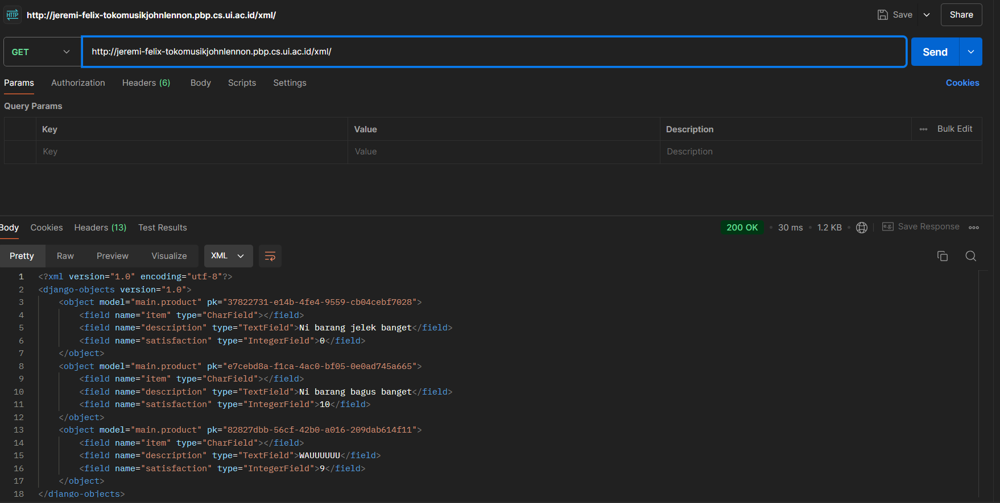
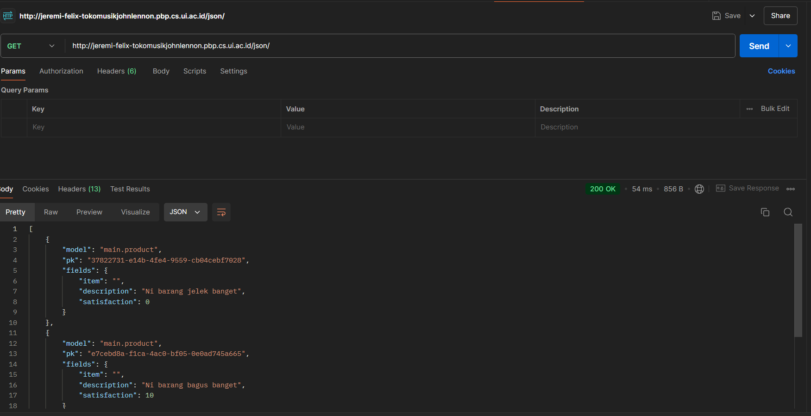
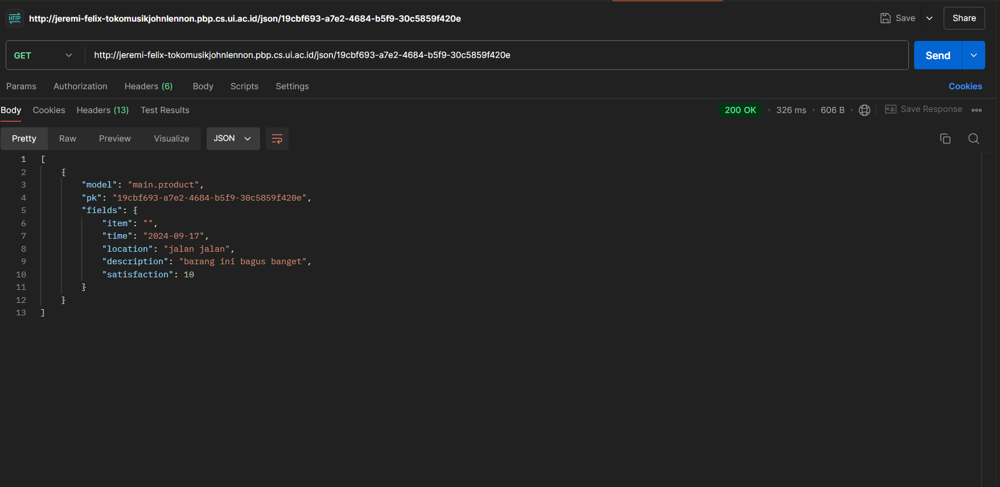

# Toko Musik John Lennon
# Deployment link
http://jeremi-felix-tokomusikjohnlennon.pbp.cs.ui.ac.id/

Sebuah proyek Django sederhana sebagai Tugas Mata Kuliah Pemrograman Berbasis Platform oleh Jeremi Felix Adiyatma 2306219575 kelas PBP B. 
## Tugas 2

### Proses Pembuatan Projek Django
1. Membuat sebuah _repository_ Github baru bernama ```Tugas2PBP```
2. Membuat inisial push ke dalam repo itu dalam bentuk readme.md
3. Di direktori asal Membuat _virtual environment_ Python baru dengan command:

    ```bash
    python -m venv env
    ```
4. Menyalakan _virtual environment_ Python baru dengan command:
    ```bash
    source env/bin/activate
    ```
5. terdapat error Execution_Policy, sehingga saya harus menjalankan command 
    ``` bash
    Set-ExecutionPolicy RemoteSigned -Scope CurrentUser
    ``` 
    di windows powershell agar dapat mengaktivasikan virtual environment.

6. Membuat berkas _requirements_ dengan 
    isi dari requirements.txt
    ```
    django
    gunicorn
    whitenoise
    psycopg2-binary
    requests
    urllib3
    ```
7. Meng-_install requirements_ dengan pip
    ```bash
    Python -m pip install -r requirements.txt
    ```
    
8. Membuat proyek Django baru dengan command:
    ```bash
    django-admin startproject toko_musik_john_lennon .
    ```
9. Mengubah ```ALLOWED_HOSTS``` di file ```settings.py``` dengan menambahkan ```"localhost"``` dan ```"127.0.0.1"```agar proyek ini bisa 
    dijalankan di host lokal

9. Membuat aplikasi ```main``` dengan command:
    ```bash
    python manage.py startapp main
    ```
10. Menambahkan ```main```  ke ```INSTALLED_APPS``` pada file ```settings.py``` di direktori ```toko_musik_john_lennon``` 

11. Modifikasi ```models.py``` menjadi:
    ```python
    from django.db import models

    class Product(models.Model):
        item = models.CharField(max_length=255)
        price = models.IntegerField()
        description = models.TextField()
    ```
12. Melakukan migrasi dengan command:
    ```
    python manage.py makemigrations
    python manage.py migrate
    ```
13. Membuat direktori templates dan menambahkan file ```main.html``` serta memodifikasi file tersebut

14. Menambahkan fungsi show_main untuk me-_render_ laman main pada file ```views.py```:
    ```python
    from django.shortcuts import render

    def show_main(request):
        context = {
           'name' : 'Jeremi Felix Adiyatma',
            'npm' : '2306219575',
            'kelas' : 'PBP B',
            'item Name' : 'Gitar Michael Jackson',
            'price': 6000000,
            'description': 'This was the guitar Michael Used on his tour in early 2009 months before he died'
        }

        return render(request, "main.html", context)

    ```
15. Me-_routing_ url pada file ```urls.py``` di direktori ```toko_musik_john_lennon``` sehingga isi file ```urls.py``` menjadi:
    ```python
    from django.contrib import admin
    from django.urls import path, include

    urlpatterns = [
        path('admin/', admin.site.urls),
        path('', include('main.urls')),
    ]
    ```

16. Melakukan routing pada aplikasi ```main``` pada file ```urls.py``` di direktori main:
    ```python
    from django.urls import path
    from main.views import show_main

    app_name = 'main'

    urlpatterns = [
        path('', show_main, name='show_main'),
    ]
    ```

17. Mengetest aplikasi pada localhost dengan command:
    ```
    python manage.py runserver
    ```
    kemudian membuka ```http://localhost:8000/``` di _browser_

18. Membuat proyek baru di pws dengan nama tokomusikjohnlennon
19. menambahkan allowed host dengan url depoloyment pws 
    ```
    ALLOWED_HOSTS = ["localhost", "127.0.0.1", "jeremi-felix-tokomusikjohnlennon.pbp.cs.ui.ac.id"]
    ```
20. add branch pws dengan command :
    ```
    git remote add pws https://pbp.cs.ui.ac.id/jeremi.felix/tokomusikjohnlennon
    ```
21. melakukan push ke repo git serta ke pws untuk deploy dengan command:
    ```
    git add .
    git commit -m "pesan"
    git push origin main
    git push pws main:master
    ```


### Jawaban dari Pertanyaan

2. **Bagan Arsitektur Django**

Permintaan _request_ dari pengguna terlebih dahulu diproses untuk diarahkan ke View yang tepat. Setelah itu, View akan berinteraksi dengan Model untuk mengambil atau memperbarui data, dan kemudian menggunakan Template untuk menampilkan informasi yang diperlukan. Akhirnya, hasil tersebut dikirim kembali ke pengguna dalam bentuk _response_.

3. **Fungsi Git dalam Pengembangan Perangkat Lunak:**

Git dalam pengembangan perangkat lunak berfungsi sebagai alat yang sangat penting untuk mengelola dan melacak perubahan pada kode. Sebagai sistem kontrol versi terdistribusi, Git memungkinkan pengembang untuk bekerja secara bersamaan pada proyek yang sama tanpa khawatir tentang konflik perubahan. Setiap perubahan yang dilakukan pada kode atau file dilacak secara detail, memungkinkan tim untuk melihat riwayat versi, menguji perubahan, dan memulihkan versi sebelumnya jika diperlukan.

Git juga mendukung kolaborasi tim dengan memfasilitasi pembuatan cabang (branch) yang memungkinkan pengembang bekerja secara terpisah pada fitur baru atau perbaikan bug tanpa memengaruhi kode utama. Setelah perubahan siap, cabang tersebut dapat digabungkan (merge) ke cabang utama. Setiap perubahan teratribusi pada pengembang yang melakukannya, sehingga memudahkan pelacakan kontribusi individu. Selain itu, Git memungkinkan pembalikan perubahan dengan mudah jika terjadi kesalahan, dan mendukung kesesuaian waktu, di mana beberapa pengembang dapat mengerjakan kode secara bersamaan tanpa saling mengganggu. Dengan semua fitur ini, Git membantu menjaga integritas proyek perangkat lunak, memastikan kolaborasi yang efisien, dan mempermudah pengelolaan proyek.

4. **Mengapa Django Dijadikan Permulaan Pembelajaran Pengembangan Perangkat Lunak?**

Django sering dipilih sebagai framework awal untuk pengembangan perangkat lunak karena menyederhanakan banyak tugas yang kompleks, memungkinkan pengembang pemula fokus pada logika aplikasi. Fitur "batteries included"-nya menyediakan solusi bawaan untuk kebutuhan umum seperti autentikasi pengguna, manajemen basis data, dan routing URL, sehingga tidak perlu terlalu banyak alat tambahan.

Selain itu, Django sangat skalabel dan cocok untuk proyek kecil maupun besar, menjadikannya platform belajar yang fleksibel. Dokumentasinya yang lengkap juga mempermudah pemula dalam mempelajari cara membangun aplikasi web.

5. **Mengapa Model pada Django Disebut Sebagai ORM?**

Model dalam Django disebut sebagai ORM (Object-Relational Mapping) karena fungsinya yang menghubungkan antara objek dalam kode Python dengan tabel dalam basis data relasional. Dengan ORM, pengembang dapat berinteraksi dengan basis data menggunakan objek Python tanpa harus menulis kueri SQL manual, sehingga mempermudah proses manipulasi data seperti membuat, membaca, memperbarui, atau menghapus data dalam tabel. ORM juga memberikan abstraksi dari basis data, artinya pengembang tidak perlu memikirkan detail-detail kompleks SQL dan bisa fokus pada logika bisnis aplikasi. Django ORM juga mendukung kompatibilitas antar berbagai sistem manajemen basis data, seperti SQLite, MySQL, dan PostgreSQL, sehingga pengembang bisa beralih antar platform basis data tanpa mengubah kode. Hal ini menjadikan ORM sebagai alat yang sangat efisien dan fleksibel dalam pengelolaan basis data di Django.


## Tugas 3
1. tambahkan direktori templates di direktori utama dan buat file base.html di dalam templates dengan isi
```html

<!DOCTYPE html>
<html lang="en">
  <head>
    <meta charset="UTF-8" />
    <meta name="viewport" content="width=device-width, initial-scale=1.0" />
     
   
  </head>

  <body>
     
  </body>
</html>

```
2. memodifikasi settings.py di direktori toko_musik_john_lennon di bagian TEMPLATES:
```py
'BACKEND': 'django.template.backends.django.DjangoTemplates',
'DIRS': [BASE_DIR / 'templates'], 
'APP_DIRS': True,
```
3. mengubah main.html menjadi:
```html
 
 
<nav>
    <h3>by {{name}}, {{npm}}, kelas {{kelas}}</h3>
</nav>
 
 ```
4. delete file db.sqlite3
5. Mengubah models.py menjadi
```py
from django.db import models
import uuid

class Product(models.Model):
    id = models.UUIDField(primary_key=True, default=uuid.uuid4, editable=False) 
    item = models.CharField(max_length=255)
    time = models.DateField(auto_now_add=True)
    location = models.TextField()
    description = models.TextField()
    satisfaction = models.IntegerField()
```
6. make migrations and migrate

7. Membuat forms.py di direktori main dengan isi
```py
from django.forms import ModelForm
from main.models import Product

class ProductEntryForm(ModelForm):
    class Meta:
        model = Product
        fields = ["description", "location", "satisfaction"]
```
8. menambahkan bagian import di views.py:
```python
from django.shortcuts import render, redirect   
from main.forms import ProductEntryForm
from main.models import Product
```

9. Menambahkan Method create_product_entry untuk menambah entri database di file views.py di direktori main
```python
def create_product_entry(request):
    form = ProductEntryForm(request.POST or None)

    if form.is_valid() and request.method == "POST":
        form.save()
        return redirect('main:show_main')

    context = {'form': form}
    return render(request, "create_product_entry.html", context)
```
10. Routing URL ke laman yang bersangkutan di file urls.py di direktori main
```py
urlpatterns = [
    ...
    path('create-product-entry', create_product_entry, name='create_product_entry'),
    ...
]
```
11. Membuat file baru bernama create_product_entry.html di main/templates/ dengan isi:
```html
 

<header>
  <h1 class="title">Add New Product Review</h1>
</header>

<div class="form-container">
  <form method="POST">
    
    <table>
      {{ form.as_table }}
      <tr>
        <td></td>
        <td>
          <input type="submit" value="Add Product Review" />
        </td>
      </tr>
    </table>
  </form>
</div>


```
serta menambahkan style

12. Mengimplementasikan database ke dalam laman utama main.html dan juga menjadi perpanjangan dari base.html di direktori utama

```html

<!-- Main Content -->
<nav>
    <h3>by {{name}}, {{npm}}, kelas {{kelas}}</h3>
</nav>

<!-- Main Content -->
<main>
    <!-- Information Section -->
    <div class="info-section">
        <!-- Text Box -->
        <div class="info-text">
            <h5>Item:</h5>
            <p>{{item}}</p>

            <h5>Price:</h5>
            <p>${{price}}</p>

            <h5>Description:</h5>
            <p>{{description}}</p>

            <!-- Purchase Button -->
            <button class="purchase-button">Purchase</button>
            <a href="">
                <button class ="review-button">Add Product Review</button>
              </a>
        </div>

        <!-- Image Box -->
        <div class="info-image">
            
        </div>
    </div>
    
    <p>Belum ada review dari produk ini.</p>
    
    <table>
        <tr>
            <th>time</th>
            <th>location</th>
            <th>description</th>
            <th>satisfaction</th>
        </tr>

     Berikut cara memperlihatkan data mood di bawah baris ini 
     
        
        <tr>
            <td>{{product_entry.time}}</td>
            <td>{{product_entry.location}}</td>
            <td>{{product_entry.description}}</td>
            <td>{{product_entry.satisfaction}}</td>
        </tr>
        
    </table>
    
</main>

<!-- Footer -->
<footer>
    <p>Contact us at johnlennonmusic@gmail.com</p>
</footer>


...
```
13. menambah design dengan menambah <styles> di main.html

13. menambahkan fungsi-fungsi yang diperlukan untuk menampilkan JSON dan XML baik secara keseluruhan maupun per entri database
```py
def show_xml(request):
    data = Product.objects.all()
    return HttpResponse(serializers.serialize("xml", data), content_type="application/xml")

def show_json(request):
    data = Product.objects.all()
    return HttpResponse(serializers.serialize("json", data), content_type="application/json")

def show_xml_by_id(request, id):
    data = Product.objects.filter(pk=id)
    return HttpResponse(serializers.serialize("xml", data), content_type="application/xml")

def show_json_by_id(request, id):
    data = Product.objects.filter(pk=id)
    return HttpResponse(serializers.serialize("json", data), content_type="application/json")
```
14. Merouting function function tadi di file urls.py direktori main. File urls.py di direktori main akan menjadi seperti berikut
```py
from django.urls import path
from main.views import show_main
from main.views import show_main, create_product_entry
from main.views import show_main, create_product_entry, show_xml, show_json, show_xml_by_id, show_json_by_id

app_name = 'main'

urlpatterns = [
    path('', show_main, name='show_main'),
    path('create-product-entry', create_product_entry, name='create_product_entry'),
    path('xml/', show_xml, name='show_xml'),
    path('json/', show_json, name='show_json'),
    path('xml/<str:id>/', show_xml_by_id, name='show_xml_by_id'),
    path('json/<str:id>/', show_json_by_id, name='show_json_by_id'),
]
```
15. Mengetest aplikasi pada localhost dengan command:
```
python manage.py runserver
kemudian membuka http://localhost:8000/ 

```
di browser
16. membuat direktori .github dan workflows di dalamnya
17. membuat file deploy.yml dan mengisi nya dengan:
    ```yml
    name: Push to PWS

    on:
    push:
        branches: [ main ]
        paths-ignore:
            - '**.md'
    pull_request:
        branches: [ main ]
        paths-ignore:
            - '**.md'

    jobs:
    build-and-push:
        runs-on: ubuntu-latest

        steps:
        - name: Checkout code
        uses: actions/checkout@v2
        with:
            fetch-depth: 0

        - name: Set up Git
        run: |
            git config --global user.name 'github-actions[bot]'
            git config --global user.email 'github-actions[bot]@users.noreply.github.com'

        - name: Check PWS remote, pull, merge, and push
        env:
            PWS_URL: ${{ secrets.PWS_URL }}
        run: |
            # Check if master branch exists locally
            if ! git show-ref --verify --quiet refs/heads/master; then
                echo "Creating master branch"
                git branch master
            fi
            
            # Switch to master branch
            git checkout master

            # Push to master branch and capture the output
            push_output=$(git push $PWS_URL main:master 2>&1)
            if [[ $? -ne 0 ]]; then
                echo "Push failed with output: $push_output"
                echo "Error: Unable to push changes. Please check the error message above and resolve any conflicts manually."
                exit 1
            fi
            echo "Push successful with output: $push_output"

    ```
18. menambah settings.py dengan:
```py
CSRF_TRUSTED_ORIGINS = ["http://localhost","http://127.0.0.1","http://jeremi-felix-tokomusikjohnlennon.pbp.cs.ui.ac.id", "http://jeremi-felix-tokomusikjohnlennon.pbp.cs.ui.ac.id"]

```
19. push ke github

### Jawaban dari pertanyaan

Berikut adalah penjelasan dari masing-masing pertanyaan yang bisa kamu tambahkan ke file README.md:

1. **Mengapa kita memerlukan data delivery dalam pengimplementasian sebuah platform?**

   Data delivery diperlukan untuk memastikan bahwa data dapat dipindahkan dengan aman dan efisien dari satu sistem ke sistem lain dalam platform. Dalam pengimplementasian platform, data delivery mencakup proses pengiriman, penerimaan, dan integrasi data di antara berbagai komponen atau layanan. Tanpa mekanisme data delivery yang baik, platform akan kesulitan dalam menjaga konsistensi data, sinkronisasi antar layanan, serta memudahkan pengambilan keputusan berbasis data. Selain itu, kecepatan dan keamanan data delivery memengaruhi pengalaman pengguna, terutama dalam aplikasi yang memerlukan real-time data transfer.

2. **Mana yang lebih baik antara XML dan JSON? Mengapa JSON lebih populer dibandingkan XML?**

   Secara umum, JSON (JavaScript Object Notation) dianggap lebih baik dalam banyak kasus dibandingkan XML (eXtensible Markup Language) untuk pertukaran data, terutama dalam pengembangan web modern. JSON lebih populer karena lebih ringan, mudah dibaca oleh manusia, dan lebih mudah di-parse oleh browser serta bahasa pemrograman modern. Selain itu, JSON memiliki struktur yang lebih sederhana tanpa kelebihan atribut atau tag, yang membuatnya lebih efisien untuk pengiriman data. Di sisi lain, XML lebih cocok jika diperlukan fleksibilitas lebih tinggi dalam menyimpan data yang kompleks dan ketika metadata tambahan dibutuhkan. Namun, popularitas JSON didorong oleh adopsi luas di berbagai framework dan API berbasis web yang lebih sering menggunakan JSON.

3. **Jelaskan fungsi dari method `is_valid()` pada form Django dan mengapa kita membutuhkan method tersebut?**

   Method `is_valid()` pada form Django digunakan untuk memeriksa apakah data yang dikirimkan melalui form sesuai dengan aturan validasi yang telah ditentukan. Method ini akan mengembalikan nilai `True` jika data yang di-submit memenuhi semua validasi (seperti tipe data, panjang karakter, atau format), dan `False` jika ada kesalahan. Kita membutuhkan method ini untuk memastikan bahwa data yang diterima oleh aplikasi adalah valid dan sesuai dengan ekspektasi, sehingga dapat mencegah terjadinya error atau eksploitasi lebih lanjut, seperti memasukkan data yang berbahaya ke dalam sistem.

4. **Mengapa kita membutuhkan `csrf_token` saat membuat form di Django? Apa yang dapat terjadi jika kita tidak menambahkan `csrf_token` pada form Django? Bagaimana hal tersebut dapat dimanfaatkan oleh penyerang?**

   `csrf_token` (Cross-Site Request Forgery token) diperlukan untuk melindungi aplikasi web dari serangan CSRF, di mana penyerang dapat membuat pengguna tanpa sadar mengirimkan permintaan berbahaya ke server tanpa persetujuan mereka. Token ini bekerja dengan memastikan bahwa setiap form yang dikirimkan berasal dari pengguna yang sah dan bukan dari skrip eksternal. Jika kita tidak menambahkan `csrf_token`, aplikasi menjadi rentan terhadap serangan CSRF, di mana penyerang dapat memanfaatkan kepercayaan pengguna terhadap situs yang sedang mereka kunjungi untuk mengirimkan permintaan yang memodifikasi data (seperti mengubah kata sandi atau melakukan transaksi ilegal) tanpa izin dari pengguna tersebut. Tanpa token ini, aplikasi tidak memiliki cara untuk membedakan apakah permintaan tersebut sah atau tidak.

### Screemshot Postman
1. **XML**

2. **XML by ID**

3. **JSON**

4. **JSON by ID**



### Tugas 4
# Penjeasan Kode
1. Tambahkan import UserCreationForm dan messages di views.py
2. tambah fungsi register di views.py untuk membuat registration form:
```py
def register(request):
    form = UserCreationForm()

    if request.method == "POST":
        form = UserCreationForm(request.POST)
        if form.is_valid():
            form.save()
            messages.success(request, 'Your account has been successfully created!')
            return redirect('main:login')
    context = {'form':form}
    return render(request, 'register.html', context)
```
3. buat register.html di direktori main/templates/
4. routing register di urls.py dengan import register from main.views dan menambahkan path register di urlpatterns
5. Tambahkan import authenticate, login, dan AuthenticationForm untuk membuat login page
6. membuat function login_user:
```py
def login_user(request):
   if request.method == 'POST':
      form = AuthenticationForm(data=request.POST)

      if form.is_valid():
            user = form.get_user()
            login(request, user)
            return redirect('main:show_main')

   else:
      form = AuthenticationForm(request)
   context = {'form': form}
   return render(request, 'login.html', context)
```
7. membuat file login.html dan routing seperti biasa
8. import logout di views.py untuk membuat function logout
9. buat fungsi logout:
```py
def logout_user(request):
    logout(request)
    return redirect('main:login')
```
10. routing function logout di urls
11. import login_required dan menambahkan 
```py
from django.contrib.auth.decorators import login_required
```
di atas function show_main
12. ambahkan import HttpResponseRedirect, reverse, dan datetime di views.py
13. mengganti function login_user, mengganti bagian if form.is_valid()  menjadi:
```py
if form.is_valid():
    user = form.get_user()
    login(request, user)
    response = HttpResponseRedirect(reverse("main:show_main"))
    response.set_cookie('last_login', str(datetime.datetime.now()))
    return response
```
14. tambahkan context di show_main dengan 'last_login': request.COOKIES['last_login']
15. tambahkan
```py
response = HttpResponseRedirect(reverse('main:login'))
response.delete_cookie('last_login')
```
di function logout_user dan ubah return jadi return response
16. import user di models.py dan tambahkan user di class Product
17. ubah function create_product_entry menjadi :
```py
def create_product_entry(request):
    form = MoodEntryForm(request.POST or None)

    if form.is_valid() and request.method == "POST":
        mood_entry = form.save(commit=False)
        mood_entry.user = request.user
        mood_entry.save()
        return redirect('main:show_main')

    context = {'form': form}
    return render(request, "create_mood_entry.html", context)
```
18. ubah value dari product_entries menjadi: Product.objects.filter(user=request.user)
19. make migrations and migrate
20. import os di settings.py dan ganti variabel DEBUG menjadi:
```py
PRODUCTION = os.getenv("PRODUCTION", False)
DEBUG = not PRODUCTION
```
## Pertanyaan
1. **Perbedaan antara `HttpResponseRedirect()` dan `redirect()`**:
   - `HttpResponseRedirect()` adalah fungsi bawaan Django yang secara eksplisit mengirimkan respons HTTP yang mengalihkan ke URL baru. Anda perlu memberikan URL sebagai argumen untuk memandu ke mana pengalihan terjadi.
   - `redirect()` adalah shortcut yang lebih fleksibel yang digunakan untuk pengalihan di Django. Selain menerima URL, `redirect()` bisa menerima argumen lain seperti *view name* atau *model object*. Jika kita berikan nama view, Django akan otomatis melakukan *reverse lookup* dan mendapatkan URL yang sesuai.

   Jadi, `redirect()` menawarkan kemudahan dan fleksibilitas dalam menentukan target pengalihan, sementara `HttpResponseRedirect()` digunakan lebih secara langsung ketika Anda sudah tahu URL tujuan.

2. **Cara kerja penghubungan model `Product` dengan `User`**:
   Dalam Django, untuk menghubungkan model `Product` dengan `User`, biasanya digunakan relasi *ForeignKey*. Misalnya, jika Anda ingin melacak siapa pengguna yang membuat atau memiliki produk, Anda bisa menambahkan *ForeignKey* di model `Product` yang merujuk ke model `User` dari Django. Contoh implementasi:
   ```python
   from django.contrib.auth.models import User
   from django.db import models

   class Product(models.Model):
       user = models.ForeignKey(User, on_delete=models.CASCADE)
   ```
   Dalam kode ini, setiap `Product` akan berhubungan dengan satu `User` (pemilik produk). Relasi ini memungkinkan Django untuk mengidentifikasi pemilik produk, serta memungkinkan akses data produk yang dibuat oleh pengguna tertentu.

3. **Perbedaan antara authentication dan authorization, serta proses yang terjadi saat login**:
   - *Authentication* adalah proses verifikasi identitas pengguna, memastikan bahwa pengguna adalah benar-benar siapa yang mereka klaim. Ini dilakukan dengan meminta kredensial seperti username dan password.
   - *Authorization* terjadi setelah *authentication*, dan ini adalah proses memastikan apakah pengguna yang sudah terotentikasi memiliki hak untuk mengakses sumber daya tertentu. Misalnya, apakah pengguna boleh melihat atau mengedit data tertentu.

   Ketika pengguna melakukan login, Django pertama-tama memverifikasi kredensial mereka melalui sistem *authentication* (misalnya, username dan password). Jika berhasil, Django membuat sesi pengguna yang menyimpan status login tersebut. Selanjutnya, untuk setiap permintaan setelah login, Django akan mengecek apakah pengguna memiliki hak akses tertentu melalui proses *authorization*.

4. **Bagaimana Django mengingat pengguna yang telah login dan kegunaan lain dari cookies**:
   Django mengingat pengguna yang telah login menggunakan mekanisme *session*. Saat pengguna login, Django menyimpan ID sesi di dalam sebuah *cookie* yang dikirim ke browser. Browser kemudian akan menyertakan cookie ini setiap kali mengirimkan permintaan berikutnya, sehingga Django dapat mengenali pengguna tersebut sebagai pengguna yang telah login.

   Selain untuk menjaga sesi login, *cookies* juga sering digunakan untuk menyimpan preferensi pengguna, pengaturan tampilan, atau data lain yang dapat memudahkan interaksi pengguna di suatu situs. Namun, tidak semua *cookies* aman. Beberapa *cookies* bisa digunakan oleh pihak ketiga untuk melacak aktivitas pengguna di berbagai situs. Oleh karena itu, praktik keamanan yang baik termasuk mengaktifkan enkripsi dan pembatasan akses pada *cookies* yang sensitif.
