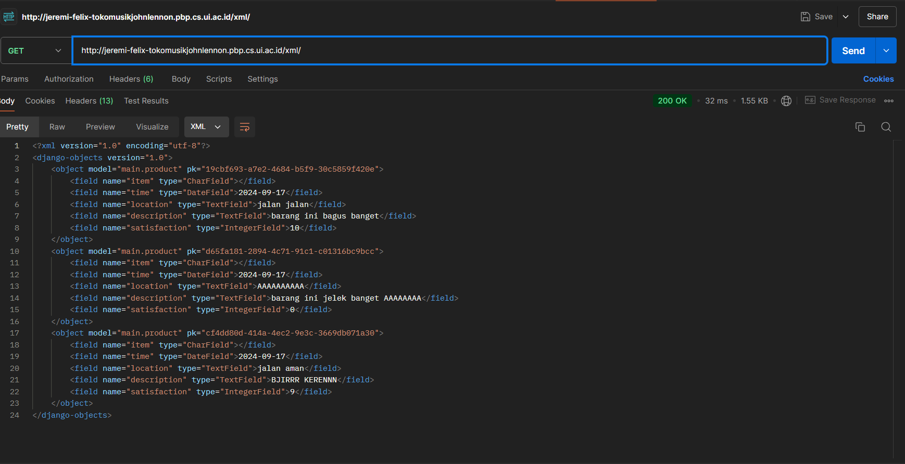
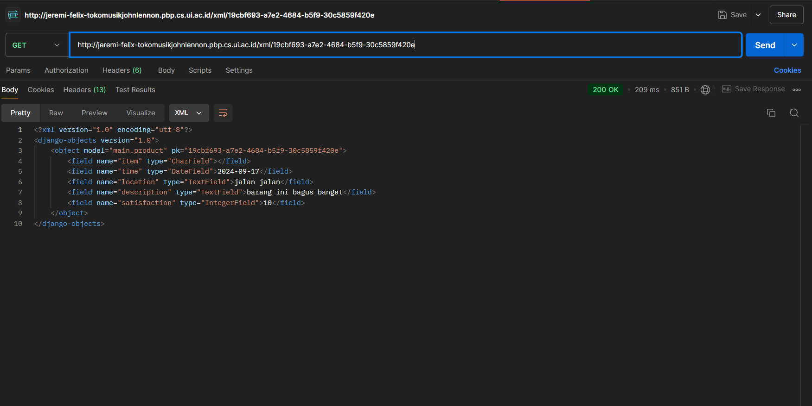
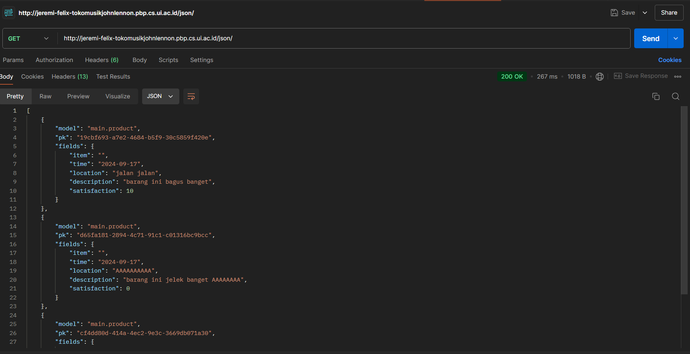

# Toko Musik John Lennon
# Deployment link
http://jeremi-felix-tokomusikjohnlennon.pbp.cs.ui.ac.id/

Sebuah proyek Django sederhana sebagai Tugas Mata Kuliah Pemrograman Berbasis Platform oleh Jeremi Felix Adiyatma 2306219575 kelas PBP B. 
## Tugas 2

### Proses Pembuatan Projek Django
1. Membuat sebuah _repository_ Github baru bernama ```Tugas2PBP```
2. Membuat inisial push ke dalam repo itu dalam bentuk readme.md
3. Di direktori asal Membuat _virtual environment_ Python baru dengan command:

    ```bash
    python -m venv env
    ```
4. Menyalakan _virtual environment_ Python baru dengan command:
    ```bash
    source env/bin/activate
    ```
5. terdapat error Execution_Policy, sehingga saya harus menjalankan command 
    ``` bash
    Set-ExecutionPolicy RemoteSigned -Scope CurrentUser
    ``` 
    di windows powershell agar dapat mengaktivasikan virtual environment.

6. Membuat berkas _requirements_ dengan 
    isi dari requirements.txt
    ```
    django
    gunicorn
    whitenoise
    psycopg2-binary
    requests
    urllib3
    ```
7. Meng-_install requirements_ dengan pip
    ```bash
    Python -m pip install -r requirements.txt
    ```
    
8. Membuat proyek Django baru dengan command:
    ```bash
    django-admin startproject toko_musik_john_lennon .
    ```
9. Mengubah ```ALLOWED_HOSTS``` di file ```settings.py``` dengan menambahkan ```"localhost"``` dan ```"127.0.0.1"```agar proyek ini bisa 
    dijalankan di host lokal

9. Membuat aplikasi ```main``` dengan command:
    ```bash
    python manage.py startapp main
    ```
10. Menambahkan ```main```  ke ```INSTALLED_APPS``` pada file ```settings.py``` di direktori ```toko_musik_john_lennon``` 

11. Modifikasi ```models.py``` menjadi:
    ```python
    from django.db import models

    class Product(models.Model):
        item = models.CharField(max_length=255)
        price = models.IntegerField()
        description = models.TextField()
    ```
12. Melakukan migrasi dengan command:
    ```
    python manage.py makemigrations
    python manage.py migrate
    ```
13. Membuat direktori templates dan menambahkan file ```main.html``` serta memodifikasi file tersebut

14. Menambahkan fungsi show_main untuk me-_render_ laman main pada file ```views.py```:
    ```python
    from django.shortcuts import render

    def show_main(request):
        context = {
           'name' : 'Jeremi Felix Adiyatma',
            'npm' : '2306219575',
            'kelas' : 'PBP B',
            'item Name' : 'Gitar Michael Jackson',
            'price': 6000000,
            'description': 'This was the guitar Michael Used on his tour in early 2009 months before he died'
        }

        return render(request, "main.html", context)

    ```
15. Me-_routing_ url pada file ```urls.py``` di direktori ```toko_musik_john_lennon``` sehingga isi file ```urls.py``` menjadi:
    ```python
    from django.contrib import admin
    from django.urls import path, include

    urlpatterns = [
        path('admin/', admin.site.urls),
        path('', include('main.urls')),
    ]
    ```

16. Melakukan routing pada aplikasi ```main``` pada file ```urls.py``` di direktori main:
    ```python
    from django.urls import path
    from main.views import show_main

    app_name = 'main'

    urlpatterns = [
        path('', show_main, name='show_main'),
    ]
    ```

17. Mengetest aplikasi pada localhost dengan command:
    ```
    python manage.py runserver
    ```
    kemudian membuka ```http://localhost:8000/``` di _browser_

18. Membuat proyek baru di pws dengan nama tokomusikjohnlennon
19. menambahkan allowed host dengan url depoloyment pws 
    ```
    ALLOWED_HOSTS = ["localhost", "127.0.0.1", "jeremi-felix-tokomusikjohnlennon.pbp.cs.ui.ac.id"]
    ```
20. add branch pws dengan command :
    ```
    git remote add pws https://pbp.cs.ui.ac.id/jeremi.felix/tokomusikjohnlennon
    ```
21. melakukan push ke repo git serta ke pws untuk deploy dengan command:
    ```
    git add .
    git commit -m "pesan"
    git push origin main
    git push pws main:master
    ```


### Jawaban dari Pertanyaan

2. **Bagan Arsitektur Django**

Permintaan _request_ dari pengguna terlebih dahulu diproses untuk diarahkan ke View yang tepat. Setelah itu, View akan berinteraksi dengan Model untuk mengambil atau memperbarui data, dan kemudian menggunakan Template untuk menampilkan informasi yang diperlukan. Akhirnya, hasil tersebut dikirim kembali ke pengguna dalam bentuk _response_.

3. **Fungsi Git dalam Pengembangan Perangkat Lunak:**

Git dalam pengembangan perangkat lunak berfungsi sebagai alat yang sangat penting untuk mengelola dan melacak perubahan pada kode. Sebagai sistem kontrol versi terdistribusi, Git memungkinkan pengembang untuk bekerja secara bersamaan pada proyek yang sama tanpa khawatir tentang konflik perubahan. Setiap perubahan yang dilakukan pada kode atau file dilacak secara detail, memungkinkan tim untuk melihat riwayat versi, menguji perubahan, dan memulihkan versi sebelumnya jika diperlukan.

Git juga mendukung kolaborasi tim dengan memfasilitasi pembuatan cabang (branch) yang memungkinkan pengembang bekerja secara terpisah pada fitur baru atau perbaikan bug tanpa memengaruhi kode utama. Setelah perubahan siap, cabang tersebut dapat digabungkan (merge) ke cabang utama. Setiap perubahan teratribusi pada pengembang yang melakukannya, sehingga memudahkan pelacakan kontribusi individu. Selain itu, Git memungkinkan pembalikan perubahan dengan mudah jika terjadi kesalahan, dan mendukung kesesuaian waktu, di mana beberapa pengembang dapat mengerjakan kode secara bersamaan tanpa saling mengganggu. Dengan semua fitur ini, Git membantu menjaga integritas proyek perangkat lunak, memastikan kolaborasi yang efisien, dan mempermudah pengelolaan proyek.

4. **Mengapa Django Dijadikan Permulaan Pembelajaran Pengembangan Perangkat Lunak?**

Django sering dipilih sebagai framework awal untuk pengembangan perangkat lunak karena menyederhanakan banyak tugas yang kompleks, memungkinkan pengembang pemula fokus pada logika aplikasi. Fitur "batteries included"-nya menyediakan solusi bawaan untuk kebutuhan umum seperti autentikasi pengguna, manajemen basis data, dan routing URL, sehingga tidak perlu terlalu banyak alat tambahan.

Selain itu, Django sangat skalabel dan cocok untuk proyek kecil maupun besar, menjadikannya platform belajar yang fleksibel. Dokumentasinya yang lengkap juga mempermudah pemula dalam mempelajari cara membangun aplikasi web.

5. **Mengapa Model pada Django Disebut Sebagai ORM?**

Model dalam Django disebut sebagai ORM (Object-Relational Mapping) karena fungsinya yang menghubungkan antara objek dalam kode Python dengan tabel dalam basis data relasional. Dengan ORM, pengembang dapat berinteraksi dengan basis data menggunakan objek Python tanpa harus menulis kueri SQL manual, sehingga mempermudah proses manipulasi data seperti membuat, membaca, memperbarui, atau menghapus data dalam tabel. ORM juga memberikan abstraksi dari basis data, artinya pengembang tidak perlu memikirkan detail-detail kompleks SQL dan bisa fokus pada logika bisnis aplikasi. Django ORM juga mendukung kompatibilitas antar berbagai sistem manajemen basis data, seperti SQLite, MySQL, dan PostgreSQL, sehingga pengembang bisa beralih antar platform basis data tanpa mengubah kode. Hal ini menjadikan ORM sebagai alat yang sangat efisien dan fleksibel dalam pengelolaan basis data di Django.


## Tugas 3
1. tambahkan direktori templates di direktori utama dan buat file base.html di dalam templates dengan isi
```html

<!DOCTYPE html>
<html lang="en">
  <head>
    <meta charset="UTF-8" />
    <meta name="viewport" content="width=device-width, initial-scale=1.0" />
     
   
  </head>

  <body>
     
  </body>
</html>

```
2. memodifikasi settings.py di direktori toko_musik_john_lennon di bagian TEMPLATES:
```py
'BACKEND': 'django.template.backends.django.DjangoTemplates',
'DIRS': [BASE_DIR / 'templates'], 
'APP_DIRS': True,
```
3. mengubah main.html menjadi:
```html
 
 
<nav>
    <h3>by {{name}}, {{npm}}, kelas {{kelas}}</h3>
</nav>
 
 ```
4. delete file db.sqlite3
5. Mengubah models.py menjadi
```py
from django.db import models
import uuid

class Product(models.Model):
    id = models.UUIDField(primary_key=True, default=uuid.uuid4, editable=False) 
    item = models.CharField(max_length=255)
    time = models.DateField(auto_now_add=True)
    location = models.TextField()
    description = models.TextField()
    satisfaction = models.IntegerField()
```
6. make migrations and migrate

7. Membuat forms.py di direktori main dengan isi
```py
from django.forms import ModelForm
from main.models import Product

class ProductEntryForm(ModelForm):
    class Meta:
        model = Product
        fields = ["description", "location", "satisfaction"]
```
8. menambahkan bagian import di views.py:
```python
from django.shortcuts import render, redirect   
from main.forms import ProductEntryForm
from main.models import Product
```

9. Menambahkan Method create_product_entry untuk menambah entri database di file views.py di direktori main
```python
def create_product_entry(request):
    form = ProductEntryForm(request.POST or None)

    if form.is_valid() and request.method == "POST":
        form.save()
        return redirect('main:show_main')

    context = {'form': form}
    return render(request, "create_product_entry.html", context)
```
10. Routing URL ke laman yang bersangkutan di file urls.py di direktori main
```py
urlpatterns = [
    ...
    path('create-product-entry', create_product_entry, name='create_product_entry'),
    ...
]
```
11. Membuat file baru bernama create_product_entry.html di main/templates/ dengan isi:
```html
 

<header>
  <h1 class="title">Add New Product Review</h1>
</header>

<div class="form-container">
  <form method="POST">
    
    <table>
      {{ form.as_table }}
      <tr>
        <td></td>
        <td>
          <input type="submit" value="Add Product Review" />
        </td>
      </tr>
    </table>
  </form>
</div>


```
serta menambahkan style

12. Mengimplementasikan database ke dalam laman utama main.html dan juga menjadi perpanjangan dari base.html di direktori utama

```html

<!-- Main Content -->
<nav>
    <h3>by {{name}}, {{npm}}, kelas {{kelas}}</h3>
</nav>

<!-- Main Content -->
<main>
    <!-- Information Section -->
    <div class="info-section">
        <!-- Text Box -->
        <div class="info-text">
            <h5>Item:</h5>
            <p>{{item}}</p>

            <h5>Price:</h5>
            <p>${{price}}</p>

            <h5>Description:</h5>
            <p>{{description}}</p>

            <!-- Purchase Button -->
            <button class="purchase-button">Purchase</button>
            <a href="">
                <button class ="review-button">Add Product Review</button>
              </a>
        </div>

        <!-- Image Box -->
        <div class="info-image">
            
        </div>
    </div>
    
    <p>Belum ada review dari produk ini.</p>
    
    <table>
        <tr>
            <th>time</th>
            <th>location</th>
            <th>description</th>
            <th>satisfaction</th>
        </tr>

     Berikut cara memperlihatkan data mood di bawah baris ini 
     
        
        <tr>
            <td>{{product_entry.time}}</td>
            <td>{{product_entry.location}}</td>
            <td>{{product_entry.description}}</td>
            <td>{{product_entry.satisfaction}}</td>
        </tr>
        
    </table>
    
</main>

<!-- Footer -->
<footer>
    <p>Contact us at johnlennonmusic@gmail.com</p>
</footer>


...
```
13. menambah design dengan menambah <styles> di main.html

13. menambahkan fungsi-fungsi yang diperlukan untuk menampilkan JSON dan XML baik secara keseluruhan maupun per entri database
```py
def show_xml(request):
    data = Product.objects.all()
    return HttpResponse(serializers.serialize("xml", data), content_type="application/xml")

def show_json(request):
    data = Product.objects.all()
    return HttpResponse(serializers.serialize("json", data), content_type="application/json")

def show_xml_by_id(request, id):
    data = Product.objects.filter(pk=id)
    return HttpResponse(serializers.serialize("xml", data), content_type="application/xml")

def show_json_by_id(request, id):
    data = Product.objects.filter(pk=id)
    return HttpResponse(serializers.serialize("json", data), content_type="application/json")
```
14. Merouting function function tadi di file urls.py direktori main. File urls.py di direktori main akan menjadi seperti berikut
```py
from django.urls import path
from main.views import show_main
from main.views import show_main, create_product_entry
from main.views import show_main, create_product_entry, show_xml, show_json, show_xml_by_id, show_json_by_id

app_name = 'main'

urlpatterns = [
    path('', show_main, name='show_main'),
    path('create-product-entry', create_product_entry, name='create_product_entry'),
    path('xml/', show_xml, name='show_xml'),
    path('json/', show_json, name='show_json'),
    path('xml/<str:id>/', show_xml_by_id, name='show_xml_by_id'),
    path('json/<str:id>/', show_json_by_id, name='show_json_by_id'),
]
```
15. Mengetest aplikasi pada localhost dengan command:
```
python manage.py runserver
kemudian membuka http://localhost:8000/ 

```
di browser
16. membuat direktori .github dan workflows di dalamnya
17. membuat file deploy.yml dan mengisi nya dengan:
    ```yml
    name: Push to PWS

    on:
    push:
        branches: [ main ]
        paths-ignore:
            - '**.md'
    pull_request:
        branches: [ main ]
        paths-ignore:
            - '**.md'

    jobs:
    build-and-push:
        runs-on: ubuntu-latest

        steps:
        - name: Checkout code
        uses: actions/checkout@v2
        with:
            fetch-depth: 0

        - name: Set up Git
        run: |
            git config --global user.name 'github-actions[bot]'
            git config --global user.email 'github-actions[bot]@users.noreply.github.com'

        - name: Check PWS remote, pull, merge, and push
        env:
            PWS_URL: ${{ secrets.PWS_URL }}
        run: |
            # Check if master branch exists locally
            if ! git show-ref --verify --quiet refs/heads/master; then
                echo "Creating master branch"
                git branch master
            fi
            
            # Switch to master branch
            git checkout master

            # Push to master branch and capture the output
            push_output=$(git push $PWS_URL main:master 2>&1)
            if [[ $? -ne 0 ]]; then
                echo "Push failed with output: $push_output"
                echo "Error: Unable to push changes. Please check the error message above and resolve any conflicts manually."
                exit 1
            fi
            echo "Push successful with output: $push_output"

    ```
18. menambah settings.py dengan:
```py
CSRF_TRUSTED_ORIGINS = ["http://localhost","http://127.0.0.1","http://jeremi-felix-tokomusikjohnlennon.pbp.cs.ui.ac.id", "http://jeremi-felix-tokomusikjohnlennon.pbp.cs.ui.ac.id"]

```
19. push ke github

### Jawaban dari pertanyaan

Berikut adalah penjelasan dari masing-masing pertanyaan yang bisa kamu tambahkan ke file README.md:

1. **Mengapa kita memerlukan data delivery dalam pengimplementasian sebuah platform?**

   Data delivery diperlukan untuk memastikan bahwa data dapat dipindahkan dengan aman dan efisien dari satu sistem ke sistem lain dalam platform. Dalam pengimplementasian platform, data delivery mencakup proses pengiriman, penerimaan, dan integrasi data di antara berbagai komponen atau layanan. Tanpa mekanisme data delivery yang baik, platform akan kesulitan dalam menjaga konsistensi data, sinkronisasi antar layanan, serta memudahkan pengambilan keputusan berbasis data. Selain itu, kecepatan dan keamanan data delivery memengaruhi pengalaman pengguna, terutama dalam aplikasi yang memerlukan real-time data transfer.

2. **Mana yang lebih baik antara XML dan JSON? Mengapa JSON lebih populer dibandingkan XML?**

   Secara umum, JSON (JavaScript Object Notation) dianggap lebih baik dalam banyak kasus dibandingkan XML (eXtensible Markup Language) untuk pertukaran data, terutama dalam pengembangan web modern. JSON lebih populer karena lebih ringan, mudah dibaca oleh manusia, dan lebih mudah di-parse oleh browser serta bahasa pemrograman modern. Selain itu, JSON memiliki struktur yang lebih sederhana tanpa kelebihan atribut atau tag, yang membuatnya lebih efisien untuk pengiriman data. Di sisi lain, XML lebih cocok jika diperlukan fleksibilitas lebih tinggi dalam menyimpan data yang kompleks dan ketika metadata tambahan dibutuhkan. Namun, popularitas JSON didorong oleh adopsi luas di berbagai framework dan API berbasis web yang lebih sering menggunakan JSON.

3. **Jelaskan fungsi dari method `is_valid()` pada form Django dan mengapa kita membutuhkan method tersebut?**

   Method `is_valid()` pada form Django digunakan untuk memeriksa apakah data yang dikirimkan melalui form sesuai dengan aturan validasi yang telah ditentukan. Method ini akan mengembalikan nilai `True` jika data yang di-submit memenuhi semua validasi (seperti tipe data, panjang karakter, atau format), dan `False` jika ada kesalahan. Kita membutuhkan method ini untuk memastikan bahwa data yang diterima oleh aplikasi adalah valid dan sesuai dengan ekspektasi, sehingga dapat mencegah terjadinya error atau eksploitasi lebih lanjut, seperti memasukkan data yang berbahaya ke dalam sistem.

4. **Mengapa kita membutuhkan `csrf_token` saat membuat form di Django? Apa yang dapat terjadi jika kita tidak menambahkan `csrf_token` pada form Django? Bagaimana hal tersebut dapat dimanfaatkan oleh penyerang?**

   `csrf_token` (Cross-Site Request Forgery token) diperlukan untuk melindungi aplikasi web dari serangan CSRF, di mana penyerang dapat membuat pengguna tanpa sadar mengirimkan permintaan berbahaya ke server tanpa persetujuan mereka. Token ini bekerja dengan memastikan bahwa setiap form yang dikirimkan berasal dari pengguna yang sah dan bukan dari skrip eksternal. Jika kita tidak menambahkan `csrf_token`, aplikasi menjadi rentan terhadap serangan CSRF, di mana penyerang dapat memanfaatkan kepercayaan pengguna terhadap situs yang sedang mereka kunjungi untuk mengirimkan permintaan yang memodifikasi data (seperti mengubah kata sandi atau melakukan transaksi ilegal) tanpa izin dari pengguna tersebut. Tanpa token ini, aplikasi tidak memiliki cara untuk membedakan apakah permintaan tersebut sah atau tidak.

### Screemshot Postman
1. **XML**

2. **XML by ID**

3. **JSON**

4. **JSON by ID**


### Tugas 4
# Penjeasan Kode
1. Tambahkan import UserCreationForm dan messages di views.py
2. tambah fungsi register di views.py untuk membuat registration form:
```py
def register(request):
    form = UserCreationForm()

    if request.method == "POST":
        form = UserCreationForm(request.POST)
        if form.is_valid():
            form.save()
            messages.success(request, 'Your account has been successfully created!')
            return redirect('main:login')
    context = {'form':form}
    return render(request, 'register.html', context)
```
3. buat register.html di direktori main/templates/
4. routing register di urls.py dengan import register from main.views dan menambahkan path register di urlpatterns
5. Tambahkan import authenticate, login, dan AuthenticationForm untuk membuat login page
6. membuat function login_user:
```py
def login_user(request):
   if request.method == 'POST':
      form = AuthenticationForm(data=request.POST)

      if form.is_valid():
            user = form.get_user()
            login(request, user)
            return redirect('main:show_main')

   else:
      form = AuthenticationForm(request)
   context = {'form': form}
   return render(request, 'login.html', context)
```
7. membuat file login.html dan routing seperti biasa
8. import logout di views.py untuk membuat function logout
9. buat fungsi logout:
```py
def logout_user(request):
    logout(request)
    return redirect('main:login')
```
10. routing function logout di urls
11. import login_required dan menambahkan 
```py
from django.contrib.auth.decorators import login_required
```
di atas function show_main
12. ambahkan import HttpResponseRedirect, reverse, dan datetime di views.py
13. mengganti function login_user, mengganti bagian if form.is_valid()  menjadi:
```py
if form.is_valid():
    user = form.get_user()
    login(request, user)
    response = HttpResponseRedirect(reverse("main:show_main"))
    response.set_cookie('last_login', str(datetime.datetime.now()))
    return response
```
14. tambahkan context di show_main dengan 'last_login': request.COOKIES['last_login']
15. tambahkan
```py
response = HttpResponseRedirect(reverse('main:login'))
response.delete_cookie('last_login')
```
di function logout_user dan ubah return jadi return response
16. import user di models.py dan tambahkan user di class Product
17. ubah function create_product_entry menjadi :
```py
def create_product_entry(request):
    form = MoodEntryForm(request.POST or None)

    if form.is_valid() and request.method == "POST":
        mood_entry = form.save(commit=False)
        mood_entry.user = request.user
        mood_entry.save()
        return redirect('main:show_main')

    context = {'form': form}
    return render(request, "create_mood_entry.html", context)
```
18. ubah value dari product_entries menjadi: Product.objects.filter(user=request.user)
19. make migrations and migrate
20. import os di settings.py dan ganti variabel DEBUG menjadi:
```py
PRODUCTION = os.getenv("PRODUCTION", False)
DEBUG = not PRODUCTION
```
## Pertanyaan
1. **Perbedaan antara `HttpResponseRedirect()` dan `redirect()`**:
   - `HttpResponseRedirect()` adalah fungsi bawaan Django yang secara eksplisit mengirimkan respons HTTP yang mengalihkan ke URL baru. Anda perlu memberikan URL sebagai argumen untuk memandu ke mana pengalihan terjadi.
   - `redirect()` adalah shortcut yang lebih fleksibel yang digunakan untuk pengalihan di Django. Selain menerima URL, `redirect()` bisa menerima argumen lain seperti *view name* atau *model object*. Jika kita berikan nama view, Django akan otomatis melakukan *reverse lookup* dan mendapatkan URL yang sesuai.

   Jadi, `redirect()` menawarkan kemudahan dan fleksibilitas dalam menentukan target pengalihan, sementara `HttpResponseRedirect()` digunakan lebih secara langsung ketika Anda sudah tahu URL tujuan.

2. **Cara kerja penghubungan model `Product` dengan `User`**:
   Dalam Django, untuk menghubungkan model `Product` dengan `User`, biasanya digunakan relasi *ForeignKey*. Misalnya, jika Anda ingin melacak siapa pengguna yang membuat atau memiliki produk, Anda bisa menambahkan *ForeignKey* di model `Product` yang merujuk ke model `User` dari Django. Contoh implementasi:
   ```python
   from django.contrib.auth.models import User
   from django.db import models

   class Product(models.Model):
       user = models.ForeignKey(User, on_delete=models.CASCADE)
   ```
   Dalam kode ini, setiap `Product` akan berhubungan dengan satu `User` (pemilik produk). Relasi ini memungkinkan Django untuk mengidentifikasi pemilik produk, serta memungkinkan akses data produk yang dibuat oleh pengguna tertentu.

3. **Perbedaan antara authentication dan authorization, serta proses yang terjadi saat login**:
   - *Authentication* adalah proses verifikasi identitas pengguna, memastikan bahwa pengguna adalah benar-benar siapa yang mereka klaim. Ini dilakukan dengan meminta kredensial seperti username dan password.
   - *Authorization* terjadi setelah *authentication*, dan ini adalah proses memastikan apakah pengguna yang sudah terotentikasi memiliki hak untuk mengakses sumber daya tertentu. Misalnya, apakah pengguna boleh melihat atau mengedit data tertentu.

   Ketika pengguna melakukan login, Django pertama-tama memverifikasi kredensial mereka melalui sistem *authentication* (misalnya, username dan password). Jika berhasil, Django membuat sesi pengguna yang menyimpan status login tersebut. Selanjutnya, untuk setiap permintaan setelah login, Django akan mengecek apakah pengguna memiliki hak akses tertentu melalui proses *authorization*.

4. **Bagaimana Django mengingat pengguna yang telah login dan kegunaan lain dari cookies**:
   Django mengingat pengguna yang telah login menggunakan mekanisme *session*. Saat pengguna login, Django menyimpan ID sesi di dalam sebuah *cookie* yang dikirim ke browser. Browser kemudian akan menyertakan cookie ini setiap kali mengirimkan permintaan berikutnya, sehingga Django dapat mengenali pengguna tersebut sebagai pengguna yang telah login.

   Selain untuk menjaga sesi login, *cookies* juga sering digunakan untuk menyimpan preferensi pengguna, pengaturan tampilan, atau data lain yang dapat memudahkan interaksi pengguna di suatu situs. Namun, tidak semua *cookies* aman. Beberapa *cookies* bisa digunakan oleh pihak ketiga untuk melacak aktivitas pengguna di berbagai situs. Oleh karena itu, praktik keamanan yang baik termasuk mengaktifkan enkripsi dan pembatasan akses pada *cookies* yang sensitif.

## Tugas 5

# Penjelasan kode
1. mengubah models.py menjadi:
```py
from django.db import models
import uuid
from django.contrib.auth.models import User

class Product(models.Model):
    user = models.ForeignKey(User, on_delete=models.CASCADE)
    id = models.UUIDField(primary_key=True, default=uuid.uuid4, editable=False) 
    item = models.CharField(max_length=255)
    picture_link = models.TextField()
    time = models.DateField(auto_now_add=True)
    price = models.IntegerField()
    description = models.TextField()
   
```
2. mengubah forms.py menjadi :
```py
from django.forms import ModelForm
from main.models import Product

class ProductEntryForm(ModelForm):
    class Meta:
        model = Product
        fields = ["item","picture_link", "price", "description"]
```
3. buat file global.css di direktori /static/css/ dan mengisinya dengan : 
```css
.form-style form input, form textarea, form select {
    width: 100%;
    padding: 0.5rem;
    border: 2px solid #bcbcbc;
    border-radius: 0.375rem;
}
.form-style form input:focus, form textarea:focus, form select:focus {
    outline: none;
    border-color: #674ea7;
    box-shadow: 0 0 0 3px #674ea7;
}
@keyframes shine {
    0% { background-position: -200% 0; }
    100% { background-position: 200% 0; }
}
.animate-shine {
    background: linear-gradient(120deg, rgba(255, 255, 255, 0.3), rgba(255, 255, 255, 0.1) 50%, rgba(255, 255, 255, 0.3));
    background-size: 200% 100%;
    animation: shine 3s infinite;
}
```
4. Menambahkan dua function di views.py, yaitu delete_product dan edit_product yang bisa diterapkan pada setiap productnya.
```py
def edit_product_entry(request, id):
    # Get mood entry berdasarkan id
    product_entry = Product.objects.get(pk = id)

    # Set mood entry sebagai instance dari form
    form = ProductEntryForm(request.POST or None, instance=product_entry)

    if form.is_valid() and request.method == "POST":
        # Simpan form dan kembali ke halaman awal
        form.save()
        return HttpResponseRedirect(reverse('main:show_main'))

    context = {'form': form}
    return render(request, "edit_product_entry.html", context)
def delete_product_entry(request, id):
    # Get mood berdasarkan id
    product_entry = Product.objects.get(pk = id)
    # Hapus mood
    product_entry.delete()
    # Kembali ke halaman awal
    return HttpResponseRedirect(reverse('main:show_main'))
```
5. routing di urls dengan import kedua function tersebut kemudian tambahkan path
```py
....
path('edit-product-entry/<uuid:id>', edit_product_entry, name='edit_product_entry'),
path('delete-product-entry/<uuid:id>', delete_product_entry, name='delete_product_entry'),

```
6. Pada base.html menambahkan beberapa code untuk responsive design web dan juga tailwind css serta add styling dengan css
```html
<meta name="viewport" content="width=device-width, initial-scale=1.0">
<script src="https://cdn.tailwindcss.com"></script>
<link rel="stylesheet" href=""/>
```
7. membuat navbar.html di /main/templates/ dan mengisinya dengan:
```html
<nav class="bg-white shadow-lg fixed top-0 left-0 z-40 w-screen">
    <div class="max-w-7xl mx-auto px-4 sm:px-6 lg:px-8">
        <div class="flex items-center justify-between h-16">
            <!-- Links for desktop -->
            <div class="hidden md:flex items-center space-x-4">
                <a href="#" class="text-gray-700 hover:text-indigo-600 font-semibold">Products</a>
                <a href="#" class="text-gray-700 hover:text-indigo-600 font-semibold">About</a>
                <a href="#" class="text-gray-700 hover:text-indigo-600 font-semibold">Contact</a>
            </div>
            
            <!-- Logo centered on all devices -->
            <div class="flex-1 text-center">
                <h1 class="text-2xl font-bold text-indigo-600">TMJL</h1>
            </div>

            <!-- Right side: Login/Logout links for desktop-->
            <div class="hidden md:flex items-center space-x-4">
                
                    <span class="text-gray-700 font-semibold">Welcome, {{ user.username }}</span>
                    <a href="" class="text-center text-red-500 hover:text-red-600 font-bold py-2 px-4 transition duration-300">
                        Logout
                    </a>
                
                    <a href="" class="text-center bg-blue-500 hover:bg-blue-600 text-white font-bold py-2 px-4 rounded transition duration-300 mr-2">
                        Login
                    </a>
                    <a href="" class="text-center bg-green-500 hover:bg-green-600 text-white font-bold py-2 px-4 rounded transition duration-300">
                        Register
                    </a>
                
            </div>

            <!-- Hamburger button for mobile -->
            <div class="md:hidden flex items-center">
                <button class="mobile-menu-button">
                    <svg class="w-6 h-6 text-indigo-600" fill="none" stroke-linecap="round" stroke-linejoin="round" stroke-width="2" viewBox="0 0 24 24" stroke="currentColor">
                        <path d="M4 6h16M4 12h16M4 18h16"></path>
                    </svg>
                </button>
            </div>
        </div>
    </div>

    <!-- Mobile menu -->
    <div class="mobile-menu hidden md:hidden px-4 w-full md:max-w-full">
        <div class="pt-2 pb-3 space-y-1 mx-auto">
            <a href="#" class="block text-center text-gray-700 hover:text-indigo-600 font-semibold py-2">Products</a>
            <a href="#" class="block text-center text-gray-700 hover:text-indigo-600 font-semibold py-2">About Us</a>
            <a href="#" class="block text-center text-gray-700 hover:text-indigo-600 font-semibold py-2">Contact</a>

            
                <a href="" class="block text-center text-red-500 hover:text-red-600 font-bold py-2 px-4 transition duration-300">
                    Logout
                </a>
            
                <a href="" class="block text-center bg-blue-500 hover:bg-blue-600 text-white font-bold py-2 px-4 rounded transition duration-300 mb-2">
                    Login
                </a>
                <a href="" class="block text-center bg-green-500 hover:bg-green-600 text-white font-bold py-2 px-4 rounded transition duration-300">
                    Register
                </a>
            
        </div>
    </div>

    <script>
        const btn = document.querySelector("button.mobile-menu-button");
        const menu = document.querySelector(".mobile-menu");

        btn.addEventListener("click", () => {
            menu.classList.toggle("hidden");
        });
    </script>
</nav>

```
8. membuat  edit_product_entry.html dengan isi yang kurang lebih sama dengan create product entry :
```html




<title>Edit Product Entry</title>





<!-- Main Wrapper with Gradient Background -->
<div class="flex flex-col min-h-screen" style="background: linear-gradient(to bottom, #87CEEB, #B0E0E6);">
  <div class="container mx-auto px-4 py-8 mt-16 max-w-md">
    <h1 class="text-3xl font-bold text-center mb-8 text-black">Edit Product Entry</h1>
  
    <div class="bg-white shadow-md rounded-lg p-6 form-style border-2 border-yellow-500">
      <form method="POST" class="space-y-6 overflow-auto max-h-[400px]">
        
        
          <div class="flex flex-col">
            <label for="{{ field.id_for_label }}" class="mb-2 font-semibold text-gray-700">
              {{ field.label }}
            </label>
            <div class="w-full">
              {{ field }}
            </div>
            
              <p class="mt-1 text-sm text-gray-500">{{ field.help_text }}</p>
            
            
              <p class="mt-1 text-sm text-red-600">{{ error }}</p>
            
          </div>
        
        <div class="flex justify-center mt-6">
            <button type="submit" class="bg-indigo-600 text-white font-semibold px-6 py-3 rounded-lg hover:bg-indigo-700 transition duration-300 ease-in-out w-full", value = "edit product entry">
              Edit Product Entry
            </button>
          </div>
       
      </form>
      
    </div>
  </div>
</div>



```
9. membuat juga card_product_entry.html dan card_info.html untuk menampilkan entry entry produk yang telah dibuat dalam bentuk persegi panjang seperti kartu
10. menyambungkan navbar dengan main, creaate_product_entry dan edit_product_entry dengan menambahkan
```html

```
di bawah block content
11. melakukan perubahan design di login,main,card_info,card_product_entry,navbar,register


# Pertanyaan 
1. Jelaskan urutan prioritas pengambilan CSS selector!

Pada CSS, terdapat aturan prioritas yang menentukan selector mana yang akan digunakan. Berikut adalah urutan prioritasnya:

    1. Important Rule: Aturan dengan penanda `!important` akan mengesampingkan semua prioritas lainnya dan memberikan prioritas tertinggi pada properti tertentu.
    2. Inline Styles: Gaya yang ditulis langsung dalam elemen HTML, seperti `style="color:blue;"`, memiliki prioritas lebih tinggi dibandingkan yang lainnya.
    3. ID Selector: Selector dengan ID, misalnya `#para1`, memiliki prioritas lebih tinggi dibandingkan selector elemen atau class.
    4. Class Selector: Selector dengan class, seperti `.center`, lebih diutamakan daripada tag HTML biasa.
    5. Tag Selector: Selector elemen HTML, seperti `h1`, memiliki prioritas yang paling rendah.

2. Mengapa responsive design menjadi konsep yang penting dalam pengembangan aplikasi web? Berikan contoh aplikasi yang sudah dan belum menerapkan responsive design!

Responsive design adalah pendekatan dalam desain web yang memungkinkan tampilan dan tata letak website atau aplikasi menyesuaikan secara otomatis dengan ukuran layar dan orientasi perangkat yang digunakan. Tujuan utamanya adalah untuk memberikan pengalaman pengguna yang konsisten dan optimal, baik itu diakses melalui desktop, laptop, maupun smartphone.

Dengan menerapkan responsive design, tampilan web dapat dioptimalkan untuk berbagai perangkat. Ini berarti elemen-elemen di halaman tidak akan terlihat berantakan atau terdistorsi saat diakses dari berbagai ukuran layar. Selain itu, responsive design juga meningkatkan aksesibilitas—pengguna tidak perlu melakukan zoom in atau zoom out saat menggunakan perangkat mobile untuk membaca teks atau mengklik tombol. Elemen seperti gambar, video, dan konten lainnya juga akan tetap terlihat baik dan efisien pada layar yang lebih kecil tanpa memperlambat performa halaman.

Contoh aplikasi yang sudah menerapkan responsive design:

- Google
- Tokopedia

Contoh aplikasi yang belum menerapkan responsive design:

- SiakNG

3. Jelaskan perbedaan antara margin, border, dan padding, serta cara untuk mengimplementasikan ketiga hal tersebut!

    1. Margin: Merupakan ruang di luar elemen, yang memisahkan elemen dari elemen lainnya. Biasanya digunakan untuk mengatur jarak antar elemen agar tata letak halaman lebih rapi.
    2. Border: Merupakan garis pembungkus elemen yang berada di antara margin dan padding. Fungsinya untuk memberikan batas visual antara elemen dan latar belakang.
    3. Padding: Adalah ruang di dalam elemen, antara konten dan border. Padding berfungsi untuk memberikan ruang di sekitar konten agar lebih mudah dibaca dan tampilannya lebih baik.

4. Jelaskan konsep flex box dan grid layout beserta kegunaannya!

Flexbox (Flexible Box) adalah metode layout satu dimensi di CSS yang digunakan untuk mengatur elemen baik secara horizontal maupun vertikal. Flexbox memudahkan penataan elemen dalam container sehingga elemen-elemen tersebut dapat menyesuaikan ukuran dan posisinya secara fleksibel dan responsif. Sedangkan Grid Layout adalah sistem layout dua dimensi yang memungkinkan developer mengatur elemen dalam baris dan kolom, sehingga lebih cocok untuk tata letak yang kompleks seperti dashboard atau galeri.

Kegunaan Flexbox:

1. Flexbox memudahkan pengaturan tata letak elemen di dalam container tanpa memerlukan `float` atau `positioning` manual.
2. Elemen dapat menyesuaikan ukurannya secara otomatis sesuai dengan ruang yang tersedia di dalam container.
3. Flexbox memudahkan penyelarasan elemen secara horizontal maupun vertikal dalam container.
4. Dengan Flexbox, tata letak elemen secara otomatis menyesuaikan ukuran layar, sehingga sangat ideal untuk desain yang responsif.
5. Properti seperti `justify-content` dan `align-items` memungkinkan pengaturan jarak antar elemen dengan mudah.
6. Urutan elemen dalam container dapat diatur ulang dengan menggunakan properti `order` tanpa mengubah struktur HTML.

Kegunaan Grid Layout:

1. Grid Layout memungkinkan pengaturan elemen dalam baris dan kolom, cocok untuk desain halaman yang kompleks seperti dashboard atau tata letak majalah.
2. Grid memberikan kontrol penuh atas ukuran kolom dan baris, menggunakan satuan seperti fraksi (fr), piksel (px), atau lainnya.
3. Elemen dapat dengan mudah ditempatkan atau direntangkan melintasi beberapa kolom atau baris menggunakan properti seperti `grid-column` dan `grid-row`.
4. Grid Layout mendukung desain responsif dengan mudah, menggunakan media queries serta properti seperti `auto-fit` dan `auto-fill`.
5. Dengan grid, pengembang dapat membuat template halaman yang konsisten dan mudah diatur menggunakan properti `grid-template-columns` dan `grid-template-rows`.
6. Grid Layout memungkinkan pengaturan ruang kosong di dalam tata letak, sehingga memberikan fleksibilitas dalam menciptakan desain yang minimalis dan estetis.

## Tugas 6

# penjelasan kode

1. import csrf_exempt dan require_POST dari decorators dan juga tambahkan function add_mood_entry_ajax di views.
import juga strip tags di views dan di forms
```py
from django.views.decorators.csrf import csrf_exempt
from django.views.decorators.http import require_POST
from django.utils.html import strip_tags
```

```py
@csrf_exempt
@require_POST
def add_product_entry_ajax(request):
    
    item = strip_tags(request.POST.get("item"))
    description = strip_tags(request.POST.get("description"))
    picture_link = request.POST.get("picture_link")
    price = request.POST.get("price")
    user = request.user

    new_product = Product(
        item=item, picture_link=picture_link,
        price=price, description = description,
        user=user
    )
    new_product.save()

    return HttpResponse(b"CREATED", status=201)
```

2. routing function baru tersebut di urls.py:
```py
from main.views import delete_product_entry , add_product_entry_ajax
```
```py
    path('create-product-entry-ajax', add_product_entry_ajax, name='add_product_entry_ajax'),

```

3. di views.py, hapus bagian context di show_main:
```py
'product_entries': product_entries
```
dan
```py
product_entries = Product.objects.filter(user=request.user)
```

4. ganti bagian show_json dan show_xml di bagian awal:
```py
data = Product.objects.filter(user=request.user)
```
5. ganti forms.py menjadi :
```py
from django.forms import ModelForm
from main.models import Product
from django.utils.html import strip_tags

class ProductEntryForm(ModelForm):
    class Meta:
        model = Product
        fields = ["item","picture_link", "price", "description"]
    def clean_item(self):
        item = self.cleaned_data["item"]
        return strip_tags(item)
    def clean_description(self):
        description = self.cleaned_data["description"]
        return strip_tags(description)
```
6. masukkan 
```html
<script src="https://cdn.jsdelivr.net/npm/dompurify@3.1.7/dist/purify.min.js"></script>

```
ke block meta untuk membersihkan Data dengan DOMPurify
7. menambahkan function function javascript yang dibutuhkan di bagian script di bagian paling bawah kode sebeleum endblock
```html
<script>
    function addProductEntry(event) {
        event.preventDefault();
        fetch("", {
          method: "POST",
          body: new FormData(document.querySelector('#productEntryForm')),
        })
        .then(response => refreshProductEntries())
    
        document.getElementById("productEntryForm").reset(); 
        hideModal();
        return false;
    }
    
    async function getProductEntries(){
        return fetch("").then((res) => res.json())
    }
    async function refreshProductEntries() {
        document.getElementById("product_entry_cards").innerHTML = "";
        document.getElementById("product_entry_cards").className = "";
        const productEntries = await getProductEntries();
        let htmlString = "";
        let classNameString = "";

        if (productEntries.length === 0) {
            classNameString = "flex flex-col items-center justify-center min-h-[24rem] p-6";
            htmlString = `
                <div class="flex flex-col items-center justify-center min-h-[24rem] p-6">
                    
                    <p class="text-center text-gray-600 mt-4">Belum ada data mood pada mental health tracker.</p>
                </div>
            `;
        }
        else {
            classNameString = "columns-1 sm:columns-2 lg:columns-3 gap-6 space-y-6 w-full"
            productEntries.forEach((product) => {
                const sanitizedItem = DOMPurify.sanitize(product.fields.item);
                const sanitizedDescription = DOMPurify.sanitize(product.fields.description);
                htmlString += `
                  <div class="relative break-inside-avoid">
                    <div class="relative top-5 bg-[#f7f7f7] shadow-md mb-6 break-inside-avoid flex flex-col border-2 border-black-500 rounded-lg w-full min-w-[350px] max-w-[100%] min-h-[580px] max-h-[580px]">
                      
                      ${product.fields.picture_link ? `
                      <div class="w-full h-60 overflow-hidden"> 
                        
                      </div>` : ''}
                      
                      <div class="p-4 flex flex-col flex-grow">
                        <h3 class="font-bold text-xl mb-2">${sanitizedItem}</h3>
                        <p class="text-gray-600">${product.fields.time}</p>
              
                        <p class="font-semibold text-lg mb-2">Price</p>
                        <p class="text-gray-700 mb-2">
                          <span class="bg-[linear-gradient(to_bottom,transparent_0%,transparent_calc(100%_-_1px),#CDC1FF_calc(100%_-_1px))] bg-[length:100%_1.5rem] pb-1">$${product.fields.price}</span>
                        </p>
                        
                        <div class="mt-4">
                          <p class="font-semibold text-lg mb-2">Description</p>
                          <p class="text-gray-700 mb-2">
                            <span class="bg-[linear-gradient(to_bottom,transparent_0%,transparent_calc(100%_-_1px),#CDC1FF_calc(100%_-_1px))] bg-[length:100%_1.5rem] pb-1">${sanitizedDescription}</span>
                          </p>
                        </div>
                      </div>
              
                      <div class="text-center text-lg font-bold mb-2">Options</div>
              
                      <div class="flex">
                        <a href="/edit-product-entry/${product.pk}" class="border-2 border-yellow-500 text-yellow-500 rounded-l-lg w-full py-2 transition duration-300 hover:bg-yellow-500 hover:text-white shadow-md text-center">
                          Edit
                        </a>
              
                        <a href="/delete-product-entry/${product.pk}" class="border-2 border-red-500 text-red-500 rounded-r-lg w-full py-2 transition duration-300 hover:bg-red-500 hover:text-white shadow-md text-center">
                          Delete
                        </a>
                      </div>
                    </div>
                  </div>
                `;
              });
              
        }
        document.getElementById("product_entry_cards").className = classNameString;
        document.getElementById("product_entry_cards").innerHTML = htmlString;
    }
    const modal = document.getElementById('crudModal');
    const modalContent = document.getElementById('crudModalContent');

    function showModal() {
        const modal = document.getElementById('crudModal');
        const modalContent = document.getElementById('crudModalContent');

        modal.classList.remove('hidden'); 
        setTimeout(() => {
            modalContent.classList.remove('opacity-0', 'scale-95');
            modalContent.classList.add('opacity-100', 'scale-100');
        }, 50); 
    }

    function hideModal() {
        const modal = document.getElementById('crudModal');
        const modalContent = document.getElementById('crudModalContent');

        modalContent.classList.remove('opacity-100', 'scale-100');
        modalContent.classList.add('opacity-0', 'scale-95');

        setTimeout(() => {
            modal.classList.add('hidden');
        }, 150); 
    }

    document.getElementById("cancelButton").addEventListener("click", hideModal);
    document.getElementById("closeModalBtn").addEventListener("click", hideModal);

    refreshProductEntries();
    document.getElementById("submitProductEntry").onclick = addProductEntry
</script>
```
8. tambahkan button baru add add new product by ajax dan juga buat modal untuk ketika kita tekan button nya. modal tersebut akan berisikan forms yang telah ditentukan 

```html
<button data-modal-target="crudModal" data-modal-toggle="crudModal" class="btn bg-indigo-700 hover:bg-indigo-600 text-white font-bold py-2 px-4 rounded-lg transition duration-300 ease-in-out transform hover:-translate-y-1 hover:scale-105" onclick="showModal();">
      Add New Product by AJAX
    </button>

  </div>

  <!-- Product Entries -->
  <div id="product_entry_cards"></div>
  <div id="crudModal" tabindex="-1" aria-hidden="true" class="hidden fixed inset-0 z-50 w-full flex items-center justify-center bg-gray-800 bg-opacity-50 overflow-x-hidden overflow-y-auto transition-opacity duration-300 ease-out">
    <div id="crudModalContent" class="relative bg-white rounded-lg shadow-lg w-5/6 sm:w-3/4 md:w-1/2 lg:w-1/3 mx-4 sm:mx-0 transform scale-95 opacity-0 transition-transform transition-opacity duration-300 ease-out">
      
      <!-- Modal header -->
      <div class="flex items-center justify-between p-4 border-b rounded-t">
        <h3 class="text-xl font-semibold text-gray-900">
          Create Product Entry
        </h3>
        <button type="button" class="text-gray-400 bg-transparent hover:bg-gray-200 hover:text-gray-900 rounded-lg text-sm p-1.5 ml-auto inline-flex items-center" id="closeModalBtn">
          <svg aria-hidden="true" class="w-5 h-5" fill="currentColor" viewBox="0 0 20 20" xmlns="http://www.w3.org/2000/svg">
            <path fill-rule="evenodd" d="M4.293 4.293a1 1 0 011.414 0L10 8.586l4.293-4.293a1 1 1 111.414 1.414L11.414 10l4.293 4.293a1 1 0 01-1.414 1.414L10 11.414l-4.293 4.293a1 1 0 01-1.414-1.414L8.586 10 4.293 5.707a1 1 0 010-1.414z" clip-rule="evenodd"></path>
          </svg>
          <span class="sr-only">Close modal</span>
        </button>
      </div>
  
      <!-- Modal body -->
      <div class="px-6 py-4 space-y-6 form-style">
        <form id="productEntryForm">
            <div class="mb-4">
                <label for="item" class="block text-sm font-medium text-gray-700">Item</label>
                <input type="text" id="item" name="item" class="mt-1 block w-full border border-gray-300 rounded-md p-2 hover:border-indigo-700" placeholder="Enter product name" required>
            </div>
            <div class="mb-4">
                <label for="pictureLink" class="block text-sm font-medium text-gray-700">picture_link</label>
                <input type="text" id="pictureLink" name="picture_link" class="mt-1 block w-full border border-gray-300 rounded-md p-2 hover:border-indigo-700" placeholder="Enter picture_link quantity" required>
            </div>       

          
            <div class="mb-4">
                <label for="price" class="block text-sm font-medium text-gray-700">Price</label>
                <input type="number" id="price" name="price" class="mt-1 block w-full border border-gray-300 rounded-md p-2 hover:border-indigo-700" placeholder="Enter product price" required>
            </div>
          
            <div class="mb-4">
                <label for="description" class="block text-sm font-medium text-gray-700">Description</label>
                <textarea id="description" name="description" rows="3" class="mt-1 block w-full h-52 resize-none border border-gray-300 rounded-md p-2 hover:border-indigo-700" placeholder="Describe the product" required></textarea>
            </div>
          
       
        </form>
      </div>
  
      <!-- Modal footer -->
      <div class="flex flex-col space-y-2 md:flex-row md:space-y-0 md:space-x-2 p-6 border-t border-gray-200 rounded-b justify-center md:justify-end">
        <button type="button" class="bg-gray-500 hover:bg-gray-600 text-white font-bold py-2 px-4 rounded-lg" id="cancelButton">Cancel</button>
        <button type="submit" id = "submitProductEntry" form="productEntryForm" class="bg-indigo-700 hover:bg-indigo-600 text-white font-bold py-2 px-4 rounded-lg">Create Product Entry</button>
      </div>
    </div>
  </div>
```

# pertanyaan

Berikut penjelasan dari pertanyaan-pertanyaan yang kamu ajukan:

### 1. Manfaat Penggunaan JavaScript dalam Pengembangan Aplikasi Web

JavaScript sangat penting dalam pengembangan aplikasi web modern karena:

- **Interaktivitas**: JavaScript memungkinkan pengembangan fitur-fitur interaktif di halaman web seperti animasi, validasi form secara real-time, drop-down menu, modal windows, dan lainnya, yang meningkatkan user experience.
  
- **Asynchronous Programming (AJAX)**: Dengan AJAX, JavaScript memungkinkan aplikasi untuk melakukan komunikasi dengan server di latar belakang tanpa harus me-reload halaman, sehingga aplikasi terasa lebih cepat dan responsif.
  
- **Cross-Platform**: JavaScript berjalan di hampir semua browser modern, baik di desktop maupun perangkat mobile, sehingga kompatibel dengan berbagai platform.

- **Frameworks & Libraries**: JavaScript didukung oleh berbagai library dan framework (seperti React, Vue.js, Angular) yang mempercepat dan memudahkan pengembangan aplikasi web modern.

- **Manipulasi DOM**: JavaScript bisa digunakan untuk memodifikasi konten halaman secara dinamis (tanpa perlu refresh), yang membuat halaman lebih responsif terhadap aksi pengguna.

### 2. Fungsi Penggunaan `await` Ketika Menggunakan `fetch()`

`await` digunakan untuk menunggu hasil dari promise, yang dalam konteks `fetch()` berarti menunggu respons dari server sebelum melanjutkan eksekusi kode berikutnya. `fetch()` sendiri bersifat asynchronous dan mengembalikan promise. Jadi, dengan `await`, kita menulis kode seolah-olah bersifat synchronous sehingga lebih mudah dipahami.

Contoh:
```javascript
const response = await fetch('https://api.example.com/data');
const data = await response.json();
```
Di sini, `await fetch(...)` akan menunggu sampai request selesai dan mengembalikan respons. Setelah itu, `data` akan diisi dengan hasil parsing dari JSON respons tersebut.

**Apa yang terjadi jika tidak menggunakan `await`?**
Jika kita tidak menggunakan `await`, `fetch()` akan mengembalikan promise yang belum selesai. Akibatnya, kode akan terus berjalan tanpa menunggu hasil respons, yang bisa menyebabkan kesalahan jika kita mencoba menggunakan data yang belum tersedia.


### 3. Mengapa Perlu Menggunakan Decorator `csrf_exempt` pada View yang Digunakan untuk AJAX POST?

Secara default, Django menerapkan perlindungan CSRF (Cross-Site Request Forgery) pada semua permintaan POST sebagai langkah keamanan. Namun, ada beberapa skenario di mana kita perlu menonaktifkan perlindungan ini, dan di sinilah decorator @csrf_exempt digunakan. Beberapa alasan pentingnya penggunaan decorator ini antara lain:

1. Mempermudah Pengujian dan Pengembangan Awal
Saat dalam tahap pengujian atau pengembangan awal, kita mungkin ingin menonaktifkan perlindungan CSRF untuk mempercepat pengujian permintaan AJAX tanpa harus menambahkan token CSRF pada setiap permintaan.

2. API untuk Aplikasi Pihak Ketiga
Jika kita membuat API yang diakses oleh klien yang tidak menggunakan mekanisme CSRF Django, seperti aplikasi mobile atau aplikasi pihak ketiga, kita perlu menonaktifkan perlindungan CSRF, karena klien ini tidak akan mengirimkan token CSRF yang diminta Django.

3. Menangani Permintaan AJAX Tanpa Token CSRF
Jika permintaan AJAX tidak menyertakan token CSRF yang valid, Django secara default akan menolak permintaan tersebut. Jika kita tidak ingin menangani validasi CSRF pada endpoint tertentu (misalnya pada endpoint API yang hanya digunakan secara internal), @csrf_exempt memungkinkan kita untuk menerima permintaan tanpa pemeriksaan token CSRF.

4. Dukungan untuk Klien Eksternal yang Tidak Menggunakan Token CSRF
Pada beberapa situasi, klien eksternal seperti layanan pihak ketiga tidak dapat atau tidak mendukung pengiriman token CSRF. Dalam hal ini, menggunakan @csrf_exempt membuat view dapat menerima permintaan meskipun tanpa adanya token CSRF.
### 4. Mengapa Pembersihan Data Input Pengguna Tidak Dilakukan di Frontend Saja?
Validasi dan pembersihan data di backend sangat penting karena lapisan frontend (client-side) dapat dimanipulasi oleh pengguna. 
Jika hanya mengandalkan validasi di frontend, pengguna yang berniat jahat dapat dengan mudah menonaktifkan atau mengubah skrip JavaScript di browser, kemudian mengirimkan data yang berpotensi berbahaya langsung ke server.
Meskipun validasi frontend menggunakan JavaScript atau HTML5 dapat memberikan umpan balik langsung kepada pengguna, terdapat beberapa keterbatasan. 
Validasi yang lebih kompleks, seperti pengecekan unik dalam database, validasi referensi antar data (seperti foreign key), atau aturan bisnis yang rumit, hanya dapat dilakukan di backend yang memiliki akses penuh ke data yang disimpan di server.